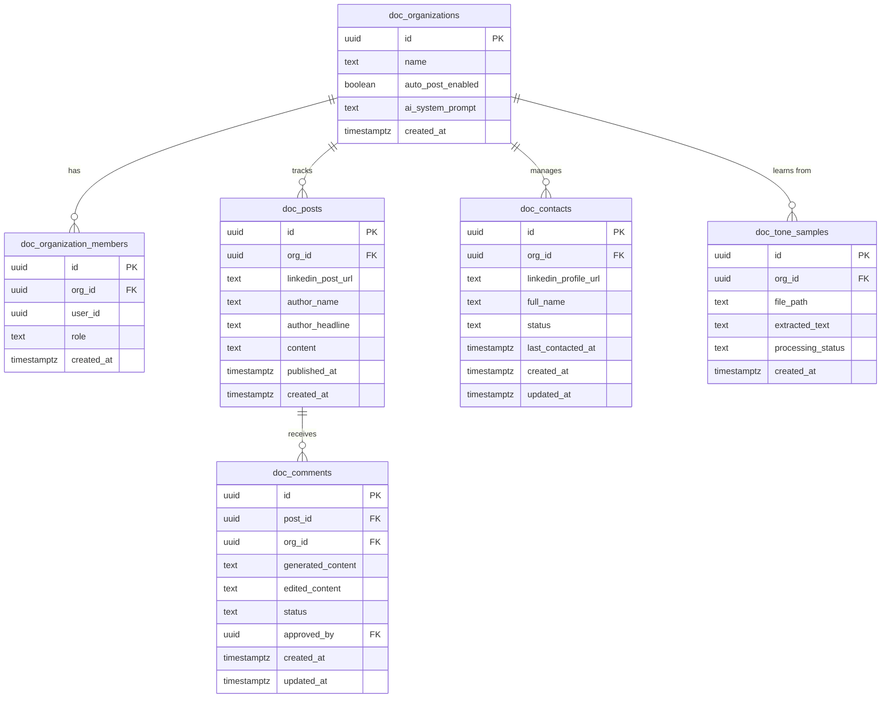

---
## Clarifying Questions Required
Before implementation begins, confirm the following:
1. Since we are using Make.com as the primary integration engine, should the Supabase application store the Google Sheets ID and trigger the sheet updates directly via Make webhooks, or do you have an existing Make scenario that handles the LinkedIn-to-Sheets pipeline entirely?
2. Which specific Apify Actors are you currently using (or planning to use) for LinkedIn scraping? (e.g., "LinkedIn Profile Scraper" vs "LinkedIn Post Commenter") This dictates the exact JSON payload shape we expect to receive in Supabase.
3. Will the CEO tone video/writing samples be uploaded directly into this application's UI, or pulled from a specific Google Drive folder via Make.com? (This PRD assumes direct UI upload to Supabase Storage for secure processing).

---

## Section 1: Executive Summary

**Project Name**: DocEngage
**Project Slug**: `doc`
**Architecture Type**: Dashboard / SaaS. *Justification: The core requirement is a clean, minimal UI to review, approve, and track pending comments and contacts, acting as a control center over underlying headless Make.com/AI automations.*
**User Model**: Multi-user, collaborative. *Justification: The primary users are non-technical team members (EA, social media managers) managing an executive's profile, requiring shared access to the same contact pipeline and approval queue. It is also intended to scale as a B2B product later.*

**Description**: 
DocEngage is a purpose-built AI engagement dashboard designed to eliminate the manual grind of LinkedIn networking for executives and their teams. By orchestrating a pipeline between LinkedIn (via Apify), OpenAI, and Google Sheets (via Make.com), DocEngage monitors physician activity, drafts authentic, tone-matched comments using the "acknowledge-insight-question" framework, and queues them for human approval. It also identifies secondary prospects within comment threads, logs all interactions, and manages a rigid follow-up cadence, allowing teams to build genuine healthcare relationships at scale without sounding automated.

**Success Mapping**: 
Success is achieved when the Social Media Manager can review, edit, and approve an AI-generated LinkedIn comment and track the resulting prospect within an interactive UI response time of < 500ms, reducing their daily engagement workflow from 2-3 hours to under 30 minutes. AI/LLM operations (generating comments or transcribing tone samples) must complete within 30 seconds with a clear loading state.

---

## Section 2: User Stories

**P0 — Must Have (Core App)**
*   **US-001**: As an admin, I want to invite team members to my organization, so that we can collaboratively manage the CEO's LinkedIn engagement.
*   **US-002**: As a user, I want the system to automatically receive scraped LinkedIn posts from Make.com/Apify, so that they are added to my review queue.
*   **US-003**: As a user, I want to view a centralized queue of pending AI-generated comments, so that I can quickly read the context and proposed response.
*   **US-004**: As a user, I want to edit and approve a pending comment, so that the system immediately triggers the Make.com webhook to post it to LinkedIn.
    *   *Acceptance Criteria*: On success, comment moves from 'Pending' to 'Approved' and disappears from the queue. On failure (Make.com unreachable), shows error and keeps in 'Pending'.
*   **US-005**: As a user, I want to view a list of identified doctor contacts and their statuses (replied, connected, no action), so that I can monitor the pipeline.
*   **US-006**: As a developer/admin, I need owner, admin, member, and read-only test accounts in the system to verify data isolation and role access.
*   **US-007**: As a user, if Make.com or the LinkedIn bridge is unavailable, I want a fallback option to manually copy the AI-generated comment to my clipboard so I can paste it directly on LinkedIn.

**P1 — Should Have (Learning & Automation)**
*   **US-008**: As a user, I want to upload video/audio/text samples of the CEO, so that the AI can extract and learn their authentic tone.
*   **US-009**: As a user, I want to toggle my organization's setting to "Auto-Post", so that comments generated with high confidence bypass the manual approval queue and post immediately.
*   **US-010**: As a system, I want to run a daily cron job to identify contacts in "no action" status for > 7 days, so that follow-up outreach is automatically triggered.

**P2 — Nice to Have (v2)**
*   **US-011**: As a user, I want advanced analytics showing my conversion rate from "commented" to "connected".

---

## Section 3: Data Model

### Entity Relationship Diagram



### Entity Descriptions

*   **`doc_organizations`**: The multi-tenant boundary. Holds the auto-post settings and the CEO's trained AI tone prompt. Supports all user stories.
*   **`doc_organization_members`**: Maps `auth.uid()` to an organization with RBAC roles (owner, admin, member). User-scoped via RLS.
*   **`doc_posts`**: Stores the raw LinkedIn posts ingested from Apify/Make. Global to the org.
*   **`doc_comments`**: Stores the AI-generated responses. Key business rule: `status` transitions strictly from `pending` -> `approved` (or `rejected`). Edited content overrides generated content on approval. Supports US-003, US-004.
*   **`doc_contacts`**: The CRM pipeline of doctors identified. Key business rule: `status` must be one of `no_action`, `connected`, `replied`. Supports US-005, US-010.
*   **`doc_tone_samples`**: Tracks uploaded media for tone analysis. `processing_status` handles async LLM transcription states (`pending`, `completed`, `failed`). Supports US-008.

---

## Section 4: External Integrations & API Contracts

### Integration: Make.com (Webhooks)
| Field | Value |
|-------|-------|
| Service | Make.com (Integromat) |
| **Research source** | https://www.make.com/en/help/tools/webhooks |
| Purpose | Acts as the automation bridge to Google Sheets and Apify |
| Direction | Bidirectional |
| Base URL | `https://hook.us1.make.com/` |
| API version | v1 |
| Auth method | Webhook HMAC (Secret token in headers) |
| Credential name | `MAKE_WEBHOOK_SECRET` |
| Credential storage | Supabase Vault |
| Trigger | User action (Approval) / Incoming webhook (Ingestion) |
| Rate limits | Varies by Make plan (handle with async queuing) |
| User stories | US-002, US-004, US-010 |

**Outbound request shape** (Supabase -> Make, upon comment approval):
```json
{
  "event": "comment_approved",
  "org_id": "uuid",
  "post_url": "https://linkedin.com/...",
  "comment_content": "Thank you for the insight...",
  "contact_name": "Dr. Smith"
}
```

**End-user device configuration** (Make.com Setup):
1. Create a new Scenario in Make.com.
2. Add a "Custom Webhook" trigger. Copy the generated URL.
3. Add a "Google Sheets -> Add a Row" module. Map the incoming payload fields (`contact_name`, `post_url`, etc.) to your sheet columns.
4. Add an "HTTP" or "Apify" module to execute the LinkedIn comment.
5. In DocEngage, navigate to Settings > Integrations and paste the Make Webhook URL.

### Integration: OpenAI API
| Field | Value |
|-------|-------|
| Service | OpenAI |
| **Research source** | https://platform.openai.com/docs/api-reference/chat |
| Purpose | Generates AI comments using the acknowledge-insight-question framework |
| Direction | Outbound |
| Base URL | `https://api.openai.com/v1/` |
| API version | v1 |
| Auth method | API Key |
| Credential name | `OPENAI_API_KEY` |
| Credential storage | Supabase Vault |
| Trigger | Incoming webhook from Make (New post ingested) |
| Rate limits | Tier-dependent (handle 429 with exponential backoff) |
| User stories | US-002, US-008 |

**Outbound request shape**:
```json
{
  "model": "gpt-4o",
  "messages": [
    {"role": "system", "content": "You are a CEO. Tone: ..."},
    {"role": "user", "content": "Draft a LinkedIn comment for this post: ..."}
  ],
  "temperature": 0.7
}
```

**Error handling**:
- On 429: Retry 3 times. If fails, save comment as `generation_failed` status.
- On 5xx: Log server-side, show "AI generation delayed" in UI.

### Integration: LinkedIn (Workaround Matrix)

| Method | Viable? | Notes |
|--------|---------|-------|
| Official API | No | The official LinkedIn API strictly prohibits automated feed monitoring and profile scraping for standard users. |
| Unofficial API | Yes | Risk of account ban if used heavily without proxy rotation. |
| Export + Ingest | Yes | Manual archive export (not viable for real-time engagement). |
| Webhook/Zapier bridge | Yes | Using Apify Actor via Make.com as the bridge. |
| Email parsing | No | LinkedIn notification emails do not contain full post text reliably. |

*Decision*: Webhook/Make.com bridge using Apify is selected as the primary workaround to orchestrate LinkedIn actions safely.

---

## Section 5: Edge Function Specifications

### `doc_inbound_post`
| Field | Value |
|-------|-------|
| Method | POST |
| Description | Receives scraped post from Make, triggers OpenAI to draft a comment, saves to DB. |
| Rate limit tier | write (10/min per IP) |
| User stories | US-002 |

**Input schema**:
```typescript
z.object({
  org_id: z.string().uuid(),
  linkedin_post_url: z.string().url(),
  author_name: z.string(),
  content: z.string(),
  secret_token: z.string() // Validated against vault
})
```
**Data transformation notes**:
- Extracts author info to construct the AI prompt.
- Checks `auto_post_enabled` in `doc_organizations`. If true, `status` = `approved` and triggers outbound webhook immediately.
- Idempotent: Skips generation if `linkedin_post_url` already exists in DB.
- Webhook Secret check: Expects `Bearer [secret]` in Authorization header, constant-time compared against `MAKE_WEBHOOK_SECRET`.

### `doc_approve_comment`
| Field | Value |
|-------|-------|
| Method | POST |
| Description | User approves comment. Updates DB, triggers Make.com webhook to post and log to sheets. |
| Rate limit tier | write |
| User stories | US-004 |

**Input schema**:
```typescript
z.object({
  comment_id: z.string().uuid(),
  edited_content: z.string().min(1).max(3000)
})
```

### `doc_process_tone`
| Field | Value |
|-------|-------|
| Method | POST |
| Description | Processes uploaded media file in Storage via OpenAI Whisper (if audio/video) or text extraction, updates the org's system prompt. |
| Rate limit tier | expensive |
| User stories | US-008 |

**Input schema**:
```typescript
z.object({
  sample_id: z.string().uuid()
})
```
**Data transformation notes**:
- If `processing_status` is already `completed`, returns early.

### `doc_daily_followups`
| Field | Value |
|-------|-------|
| Method | POST |
| Description | Cron-triggered function that finds contacts in `no_action` for > 7 days and pushes them to Make.com for follow-up. |
| Rate limit tier | auth (Cron only) |
| User stories | US-010 |

---

## Section 6: Security Architecture

### 6.1 Authentication Model
- **Client-side**: Supabase anon key ONLY.
- **Identity derivation**: ALWAYS from JWT via `auth.uid()`.
- **service_role key**: NOT USED for application data. Used exclusively in the `doc_daily_followups` cron wrapper where a user context is absent.
- **Signup**: Public signup disabled after the initial owner account creation. Members are invited via `admin.auth` API.
- **JWT expiry**: 1 hour with refresh (Dashboard/SaaS standard).
- **Email confirmation**: Required in production.

### 6.2 Row Level Security
- Every table has RLS enabled.
- Data access is bound by the `doc_organization_members` mapping.
- Example `doc_posts` policy: `SELECT` allowed if `auth.uid() IN (SELECT user_id FROM doc_organization_members WHERE org_id = doc_posts.org_id)`.

### 6.3 Edge Function Security
Every edge function uses standard wrappers:
1. CORS preflight handling.
2. JWT verification (or secure token validation for inbound webhooks).
3. Rate limiting by IP or Org.
4. Input validation via Zod.
5. User-scoped DB operations.

### 6.4 Input Validation
- Request bodies exceeding 100KB are rejected automatically.
- URLs strictly validated to prevent SSRF if fetched.

### 6.5 Storage
- Bucket `doc_tone_uploads` is PRIVATE by default.
- Object paths follow `/{org_id}/{uuid}.{ext}`.
- Access via signed URLs only.

### 6.6 Database Functions
- All custom Postgres functions use `SECURITY INVOKER`.
- No raw SQL interpolation.

### 6.7 Realtime
- Realtime is enabled ONLY on `doc_comments` for the `status` column, allowing the UI to instantly remove a comment from the queue if another team member approves it.

### 6.8 CI Security Gates
Enforced via GitHub Actions (Security Templates):
1. RLS enabled on all tables.
2. No public storage buckets.
3. Input validation present in edge functions.

### 6.9 Security Assumptions and Boundaries
- Apify ban risks: DocEngage is not responsible for LinkedIn account bans resulting from Apify actor usage limits.
- The webhook token securing Make -> Supabase must be kept secret. Token rotation is manual.
- XSS prevention depends on the frontend framework's native sanitization.

---

## Section 7: Abuse Test Specification

### Cross-user data isolation tests
- User A (Org 1) cannot SELECT `doc_posts` belonging to Org 2.
- User A cannot UPDATE a comment ID belonging to Org 2.
- User A cannot trigger `doc_process_tone` for a `sample_id` outside their org.

### Edge function auth tests
- `doc_approve_comment` rejects requests with no JWT (→ 401).
- `doc_inbound_post` rejects requests with invalid `secret_token` (→ 401).

### Input validation tests
- `doc_approve_comment` rejects `edited_content` > 3000 chars (LinkedIn limit) (→ 400).
- `doc_inbound_post` gracefully handles missing `author_name` (defaults to "Author").

### Business logic abuse tests
- **Double-Approval Replay**: Submitting `doc_approve_comment` twice for the same `comment_id` must only trigger the Make.com webhook ONCE. Function must check `status = 'pending'` before proceeding.
- **Privilege Escalation**: A user with role `member` cannot change the `auto_post_enabled` boolean in `doc_organizations`.

---

## Section 8: Hardened Ops

### Graceful Degradation
| Dependency | Failure Mode | User Experience | Technical Behavior |
|-----------|-------------|----------------|-------------------|
| Supabase DB | Down / timeout | "Dashboard temporarily unavailable" | Return 503 |
| OpenAI API | Down / timeout | "AI draft unavailable - manual entry required" | DB saves post, comment status = `generation_failed` |
| Make.com | Webhook fails | "Failed to post to LinkedIn. Click here to copy text." | DB status remains `pending`, UI shows clipboard fallback |
| Supabase Storage | Whisper API fails | "Transcription failed. Retry." | File is NOT deleted. `processing_status` = `failed`. |

**File processing pipeline rule (US-008)**:
When a user uploads a video for tone learning:
1. Storage upload succeeds.
2. OpenAI Whisper fails.
3. The video file is NEVER deleted.
4. The `doc_tone_samples` record updates to `processing_status = 'failed'`.
5. The UI shows a retry affordance. Error logged server-side.

### Logging
- Rate limit triggers logged with IP/User_ID.
- Make.com outbound webhook 5xx errors logged with `comment_id`.

---

## Section 9: Non-Goals and Out of Scope

- **Direct LinkedIn API Integration** — Completely excluded. Bypassing Make.com to communicate directly with LinkedIn from Supabase edge functions is out of scope due to anti-automation protections.
- **Direct Google Sheets API connection** — Excluded. We route all sheet logging through the Make.com webhooks to adhere to the visual automation constraint.
- **Native Mobile App** — Out of scope. Desktop-first web dashboard only.
- **Complex multi-step conversation AI** — The AI writes a single comment. Back-and-forth automated DM chatting is excluded from v1 to prevent sounding like spam.
- **Billing and Subscription Management** — Out of scope for this internal-first phase.

---

## Section 10: Security Checklist (Definition of Done)

- [ ] All tables have RLS enabled and tested.
- [ ] Multi-tenant isolation is verified (Org A cannot see Org B).
- [ ] No `service_role` keys are exposed in the client code.
- [ ] Edge functions require JWT or strict Webhook Secret validation.
- [ ] Input schemas exist and restrict sizes/types in all Edge Functions.
- [ ] Private storage buckets are utilized for sensitive tone media.
- [ ] Error messages returned to the client are sanitized (no stack traces).

---

## Agent Instructions

When implementing this PRD, the coding agent MUST:
1. Reason step-by-step before writing code. Plan the approach, then execute.
2. Clone and integrate the security templates repo BEFORE writing any feature code.
3. Validate the database schema against this PRD before writing queries.
4. Never bypass RLS. Never use `service_role` for application data unless inside the cron job wrapper explicitly.
5. Always derive user identity from the JWT (`auth.uid()`) and validate `org_id` against `doc_organization_members`.
6. Prefix all database structures with `doc_`.
7. **Dashboard/SaaS Instruction**: Ensure the UI relies heavily on optimistic updates for comment approvals, reverting state if the Make.com edge function returns an error.
8. Validate all edge function inputs with Zod before database operations.
9. Store the Make Webhook URL and Secret in Supabase Vault; never hardcode them.
10. Wrap the OpenAI API call in `doc_inbound_post` in a try/catch. On failure, insert the post but leave the comment blank with status `generation_failed`. Do NOT throw an unhandled 500.
11. Implement the Make.com configuration steps from Section 4 into a `scripts/setup-integrations.md` file.
12. For the `doc_inbound_post` webhook receiver, perform a constant-time comparison on the `Bearer [secret]` against the Vault secret to prevent timing attacks. Check timestamps if provided in the Make.com payload to mitigate replay attacks.