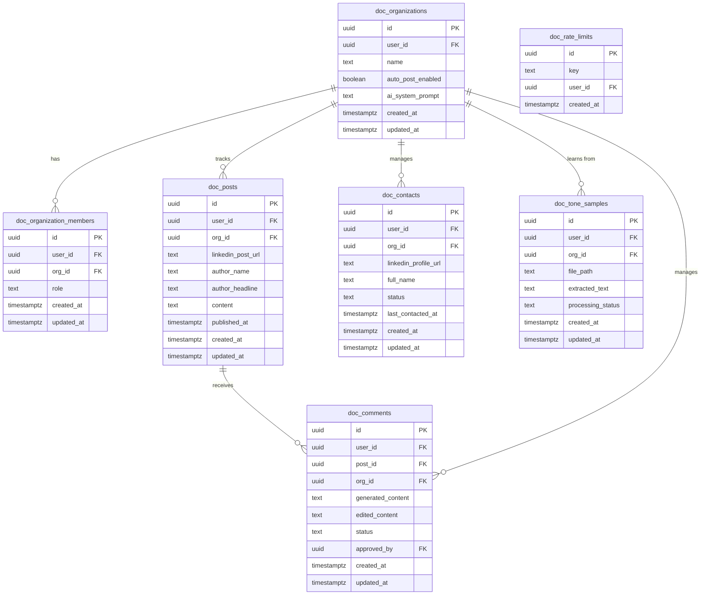

# DocEngage Architecture Document

## Section 1: Project Overview

- **Project name**: DocEngage
- **Project slug**: `doc`
- **Description**: DocEngage is a purpose-built AI engagement dashboard designed to eliminate the manual grind of LinkedIn networking for executives and their teams. It orchestrates a pipeline between LinkedIn (via Apify/Make.com), OpenAI, and Google Sheets, monitoring prospect activity, drafting authentic tone-matched comments, and queuing them for human approval via an interactive interface.
- **Architecture type**: Dashboard / SaaS. *Justification: The core requirement is a clean, minimal UI to review, approve, and track pending comments and contacts, acting as a control center over underlying headless Make.com/AI automations.*
- **Target user profile**: Multi-user, collaborative, non-technical team members (EAs, social media managers) securely managing an executive's profile.
- **External integrations**:
  - **Make.com**: Bidirectional — Acts as the automation bridge to Google Sheets and Apify for LinkedIn ingestion and posting.
  - **OpenAI API**: Outbound — Generates AI comments using the acknowledge-insight-question framework and transcribes tone samples.

---

## Section 2: Technology Stack

| Layer | Technology | Version | Rationale |
|-------|-----------|---------|-----------|
| Frontend | Vite + React + TypeScript | 5.x / 18.x | High-performance SPA ideal for a low-latency dashboard with optimistic UI updates. |
| UI Component Library | shadcn/ui + Tailwind CSS | Latest | Provides clean, accessible, and customizable components for a professional SaaS UI. |
| State Management | TanStack Query (React Query) | 5.x | Handles server state, caching, and optimistic UI updates for < 500ms response times. |
| Auth | Supabase Auth | - | JWT-based identity derivation perfectly suited for Edge Functions and RLS multi-tenant scoping. |
| Database | Supabase Postgres | 15.x | Fully relational data store supporting Row Level Security for data isolation. |
| Edge Functions | Supabase Edge Functions (Deno) | - | Trusted server-side execution for third-party API integration and credential hiding. |
| Storage | Supabase Storage | - | Private bucket hosting for sensitive CEO tone video/audio samples. |
| Make.com | Raw `fetch` API | - | Lightweight native Deno fetch is sufficient for sending predefined webhook JSON payloads. |
| OpenAI API | Raw `fetch` API / API | - | Keeps edge functions minimal without heavyweight SDKs, interacting via REST endpoints. |
| Deployment | Vercel | Latest | Seamless SPA deployment with global CDN for fast dashboard loading. |

---

## Section 3: Project Structure

```text
/
├── src/
│   ├── lib/
│   │   ├── supabaseClient.ts               ← from security templates
│   │   ├── apiClient.ts                    ← from security templates
│   │   └── queryClient.ts                  ← TanStack Query setup
│   ├── components/
│   │   ├── ui/                             ← shadcn components
│   │   └── dashboard/                      ← Feature-specific components
│   ├── pages/
│   │   ├── auth/
│   │   ├── queue/                          ← Pending comments review
│   │   ├── contacts/                       ← CRM pipeline view
│   │   └── settings/                       ← Org & tone configuration
│   ├── hooks/                              ← Custom optimistic UI hooks
│   ├── types/                              ← Shared TS definitions
│   └── main.tsx
├── supabase/
│   ├── migrations/
│   │   └── 001_initial_schema.sql          ← from seed SQL output
│   ├── functions/
│   │   ├── _shared/                        ← from security templates
│   │   │   ├── auth.ts
│   │   │   ├── rate-limit.ts
│   │   │   ├── cors.ts
│   │   │   ├── validate.ts
│   │   │   └── error-handler.ts
│   │   ├── doc_inbound_post/
│   │   │   └── index.ts
│   │   ├── doc_approve_comment/
│   │   │   └── index.ts
│   │   ├── doc_process_tone/
│   │   │   └── index.ts
│   │   └── doc_daily_followups/
│   │       └── index.ts
│   └── seed.sql
├── scripts/
│   └── setup-integrations.md               ← credential setup for Make.com & OpenAI
├── tests/
│   └── abuse-test.ts                       ← from security templates, extended for Org isolation
├── docs/
│   ├── architecture/
│   ├── deployment/
│   │   └── MANUAL_SQL_OPERATIONS.md
│   └── domain/
├── .github/
│   └── workflows/
│       └── security-checks.yml             ← from security templates
├── .semgrep/
│   └── semgrep-rules.yml                   ← from security templates
├── .env.example
├── .gitignore
├── CLAUDE.md
└── README.md
```

---

## Section 4: Data Model

### Entity Relationship Diagram



### Table Descriptions

- **`doc_rate_limits`**: Lookup table tracking API execution frequency. User-scoped via `user_id` to throttle specific Edge Functions per user.
- **`doc_organizations`**: The multi-tenant boundary holding the auto-post toggles and the CEO's trained AI tone prompt. (Supports US-001, US-009).
- **`doc_organization_members`**: Maps `auth.uid()` to an organization with RBAC roles (owner, admin, member). (Supports US-001, US-006).
- **`doc_posts`**: Stores raw LinkedIn posts ingested via Make.com/Apify. (Supports US-002).
- **`doc_comments`**: Stores AI-generated responses (OpenAI via Edge Functions). Transitions strictly from `pending` -> `approved`/`rejected`. Stores data received from the OpenAI API. (Supports US-003, US-004).
- **`doc_contacts`**: The CRM pipeline of doctors identified. Tracks status (`no_action`, `connected`, `replied`). (Supports US-005, US-010).
- **`doc_tone_samples`**: Tracks uploaded media paths for tone analysis via OpenAI Whisper. Handles async LLM states. (Supports US-008).

---

## Section 5: Auth Flow

1. User opens app.
2. Client initializes Supabase with ANON KEY (`supabaseClient.ts`).
3. User signs in (Email/Password via magic link or standard credentials). Note: Open signup is disabled in production after initial owner account creation; members are invited.
4. Supabase Auth returns a JWT containing `user.id`.
5. Client stores the session (Supabase JS handles this automatically).
6. Every subsequent request includes the JWT in the Authorization header.
7. For direct DB queries: PostgREST extracts `auth.uid()` from the JWT. RLS checks mapping in `doc_organization_members` to filter visible rows.
8. For edge functions: `requireAuth()` extracts the user from the JWT → `createUserClient()` scopes database queries to that user.
9. On token expiry: Supabase JS auto-refreshes using the refresh token (JWT valid for 1 hour).
10. On logout: Session is destroyed client-side.

*Note: All OAuth2 UI flows are excluded because internal integrations (Make, OpenAI) utilize API Keys/Webhooks rather than user-level OAuth.*

---

## Section 6: External Integration Architecture

### Make.com (Webhooks)

**Integration summary:**
| Field | Value |
|-------|-------|
| Direction | Bidirectional |
| Trigger | User action (Approval) / Incoming webhook (Ingestion) |
| Auth method | Webhook HMAC (Secret token in headers) |
| Called from | `doc_approve_comment` edge function |
| Credential(s) | `MAKE_WEBHOOK_SECRET` (Supabase Vault) |
| Rate limit | Varies by Make plan — handle with async queuing |

**Request path** (Outbound - Supabase → Make):
```text
Edge Function (doc_approve_comment)
  → fetch(https://hook.us1.make.com/[webhook_id])
    Headers: Content-Type: application/json
    Body: {
      "event": "comment_approved",
      "org_id": "uuid",
      "post_url": "https://linkedin.com/...",
      "comment_content": "Thank you for the insight...",
      "contact_name": "Dr. Smith"
    }
  ← Response: 200 OK
  → Update status in doc_comments to 'approved'
```

**Webhook path** (Inbound - Make → Supabase):
```text
Make.com webhook
  → POST /functions/v1/doc_inbound_post
    Headers: Authorization: Bearer [secret]
    Body: {
      "org_id": "uuid",
      "linkedin_post_url": "url",
      "author_name": "string",
      "content": "string",
      "secret_token": "string"
    }
  → Edge function doc_inbound_post constant-time compares secret_token with MAKE_WEBHOOK_SECRET
  → On success, records in doc_posts and triggers OpenAI payload.
```

**Failure handling**:
- On 401: Reject inbound payload.
- On 429/5xx (Outbound): DB status remains `pending`, UI shows clipboard fallback affordance ("Failed to post to LinkedIn. Click here to copy text").
- Credential setup: See `scripts/setup-integrations.md`.

### OpenAI API

**Integration summary:**
| Field | Value |
|-------|-------|
| Direction | Outbound |
| Trigger | Incoming webhook from Make (New post) / File Upload |
| Auth method | API Key |
| Called from | `doc_inbound_post`, `doc_process_tone` |
| Credential(s) | `OPENAI_API_KEY` (Supabase Vault) |
| Rate limit | Tier-dependent — handle 429 with exponential backoff |

**Request path** (Outbound calls):
```text
Edge Function
  → fetch(https://api.openai.com/v1/chat/completions)
    Headers: Authorization: Bearer ${Deno.env.get("OPENAI_API_KEY")}
    Body: {
      "model": "gpt-4o",
      "messages": [
        {"role": "system", "content": "You are a CEO. Tone: ..."},
        {"role": "user", "content": "Draft a LinkedIn comment for this post: ..."}
      ],
      "temperature": 0.7
    }
  ← Response: { "choices": [{ "message": { "content": "..." } }] }
  → Parse and store in doc_comments
```

**Failure handling**:
- On 401: Log critical configuration error.
- On 429: Retry 3 times with exponential backoff. If fails, save comment as `generation_failed` status.
- On 5xx: Log server-side, show "AI generation delayed" in UI.
- Credential setup: See `scripts/setup-integrations.md`.

---

## Section 7: Data Flow Diagrams

### [User Action / System Trigger: Ingest Post & Draft Comment]
```text
Make.com (Apify Scraper)
  → POST /functions/v1/doc_inbound_post
    Headers: Authorization: Bearer <secret_token>
    Body: { org_id, linkedin_post_url, author_name, content, secret_token }
  → Edge Function: doc_inbound_post/index.ts
    1. handlePreflight(req)
    2. Validate secret_token against Vault MAKE_WEBHOOK_SECRET
    3. validateBody(req, schema)
    4. Check idempotency: does linkedin_post_url exist?
    5. Read doc_organizations WHERE id = org_id (fetch system prompt & auto_post setting)
    6. fetch("https://api.openai.com/v1/chat/completions", { prompt + post })
       → On 429: Retry 3 times
       → On 5xx: Insert post, comment status = 'generation_failed'
    7. supabase.from("doc_posts").insert({...}).select()
    8. supabase.from("doc_comments").insert({ generated_content, status: 'pending' })
       * If auto_post_enabled is TRUE, status = 'approved' and triggers outbound Make webhook
    9. Return 200 OK to Make.com
```

### [User Action: Approve Comment]
```text
Client (browser)
  → POST /functions/v1/doc_approve_comment
    Headers: Authorization: Bearer <jwt>
    Body: { comment_id: "uuid", edited_content: "Great point..." }
  → Edge Function: doc_approve_comment/index.ts
    1. handlePreflight → requireAuth → rateLimit → validateBody
    2. createUserClient(req)
    3. Read comment + post details via RLS
    4. Guard clause: Ensure status is 'pending' (prevent double-approval replay)
    5. fetch(MAKE_WEBHOOK_URL, { headers, body: { event: "comment_approved", ... } })
       → SUCCESS PATH:
         Update doc_comments SET status = 'approved', edited_content = ...
         Return { data: { status: "approved" } }
       → FAILURE PATH (Make.com down):
         Leave status = 'pending'
         Return 500: "Failed to post to LinkedIn. Click here to copy text."
  ← Response sent to client
```

### [User Action: Upload Tone Sample (File Processing Pipeline)]
```text
Client → uploads file to Supabase Storage
  → Storage: {org_id}/{uuid}.{ext} saved to doc_tone_uploads bucket
  → Client calls POST /functions/v1/doc_process_tone
      Body: { sample_id: "uuid" }
  → Edge Function: doc_process_tone/index.ts
    1. handlePreflight → requireAuth → rateLimit → validateBody
    2. createUserClient(req)
    3. Download file buffer from Storage (private URL via user-scoped client)
    4. fetch("https://api.openai.com/v1/audio/transcriptions", { body: formData })
       → SUCCESS PATH:
         Update doc_tone_samples SET processing_status = 'completed', extracted_text = ...
         Update doc_organizations SET ai_system_prompt = <new_prompt>
         Return 200 OK
       → FAILURE PATH (Whisper API fails):
         Update doc_tone_samples SET processing_status = 'failed'
         Log: { file_path, service: 'OpenAI Whisper', status_code, timestamp }
         DO NOT delete file from storage
         Return 500: "Transcription failed. Retry."
```

---

## Section 8: Edge Function Inventory

| Function | Method | Rate Limit | Description | External Calls |
|----------|--------|-----------|-------------|----------------|
| `doc_inbound_post` | POST | write | Receives scraped post from Make, triggers OpenAI to draft a comment, saves to DB. | OpenAI (Generate text) |
| `doc_approve_comment` | POST | write | User approves comment. Updates DB, triggers Make.com webhook to post and log to sheets. | Make.com (Webhook) |
| `doc_process_tone` | POST | expensive | Processes uploaded media file in Storage via OpenAI Whisper/Text, updates org system prompt. | OpenAI (Whisper) |
| `doc_daily_followups`| POST | auth | Cron-triggered wrapper pushing `no_action` contacts > 7 days old to Make.com for follow-up. | Make.com (Webhook) |

**1. `doc_inbound_post`**
- Input schema:
  ```typescript
  z.object({
    org_id: z.string().uuid(),
    linkedin_post_url: z.string().url(),
    author_name: z.string(),
    content: z.string(),
    secret_token: z.string()
  })
  ```
- Reads: `doc_organizations` (settings/prompt), `doc_posts` (idempotency).
- Writes: `doc_posts`, `doc_comments`.
- External Call: OpenAI API.
- Responses: 200 `{ success: true }`, 401 (Invalid Webhook Secret), 500 (Internal parsing error).

**2. `doc_approve_comment`**
- Input schema:
  ```typescript
  z.object({
    comment_id: z.string().uuid(),
    edited_content: z.string().min(1).max(3000)
  })
  ```
- Reads: `doc_comments`, `doc_posts`.
- Writes: `doc_comments`.
- External Call: Make.com Webhook.
- Responses: 200 `{ success: true, status: 'approved' }`, 400 (Invalid input), 401 (Missing JWT), 429 (Rate limited), 500 (Make.com webhook fails).

**3. `doc_process_tone`**
- Input schema:
  ```typescript
  z.object({
    sample_id: z.string().uuid()
  })
  ```
- Reads: `doc_tone_samples`.
- Writes: `doc_tone_samples`, `doc_organizations`.
- External Call: OpenAI Whisper.
- Responses: 200 `{ success: true }`, 400 (Invalid sample_id), 401 (Missing JWT), 500 (Whisper failure).

**4. `doc_daily_followups`**
- Input schema: None (Cron signature verified).
- Reads: `doc_contacts`.
- Writes: `doc_contacts` (Update last_contacted_at).
- External Call: Make.com Webhook.
- Responses: 200 `{ processed: number }`.

---

## Section 9: Error Handling & Resilience

| Failure | User Experience | Technical Behavior |
|---------|----------------|-------------------|
| Supabase DB down | "Dashboard temporarily unavailable" | Return 503 |
| JWT expired | Silent refresh | Supabase JS auto-refreshes; redirect to login if refresh fails |
| Rate limited | "Too many requests, please wait" | 429 with Retry-After header |
| Invalid input | Field-level error messages | 400 with Zod error details |
| RLS blocks access | Generic "not found" | Query returns empty set, not 403 |
| OpenAI API down / timeout | "AI draft unavailable - manual entry required" | DB saves post, comment status = `generation_failed` |
| Make.com webhook fails | "Failed to post to LinkedIn. Click here to copy text." | DB status remains `pending`, UI shows clipboard fallback |
| Supabase Storage (Whisper) API fails | "Transcription failed. Retry." | File is NOT deleted. `processing_status` = `failed`. |

**File processing pipeline rule (US-008 mandatory behavior):**
For the `doc_process_tone` pipeline:
- Storage success and processing success are treated as separate events.
- On processing failure (OpenAI Whisper error): File is preserved in `doc_tone_uploads`, `doc_tone_samples` record status is set to `failed`, and a retry affordance is shown in UI.
- On storage failure: Standard upload error, no DB record created.
- Logging on processing failure MUST include: file path, external service name (`OpenAI`), response status code, and timestamp.

**LLM-specific resilience:**
- Primary model: `gpt-4o`
- Fallback model: None specified natively, handles gracefully by defaulting status to `generation_failed` to allow manual intervention.
- Timeout threshold: 30 seconds.
- Loading state: UI must show generating/pending indicator within 500ms of post ingestion/request start.

---

## Section 10: Security Architecture

**Table → RLS policy mapping:**
| Table | Select Policy | Insert Policy | Update Policy | Delete Policy |
|-------|-------------|---------------|---------------|---------------|
| `doc_organizations` | `doc_organizations_select_own` | `...insert_own` | `...update_own` | `...delete_own` |
| `doc_organization_members` | `doc_organization_members_select_own` | `...insert_own` | `...update_own` | `...delete_own` |
| `doc_posts` | `doc_posts_select_own` | `...insert_own` | `...update_own` | `...delete_own` |
| `doc_comments` | `doc_comments_select_own` | `...insert_own` | `...update_own` | `...delete_own` |
| `doc_contacts` | `doc_contacts_select_own` | `...insert_own` | `...update_own` | `...delete_own` |
| `doc_tone_samples` | `doc_tone_samples_select_own` | `...insert_own` | `...update_own` | `...delete_own` |

*Note: All policies inherently scope access based on matching `user_id` mapped through `doc_organization_members` to the corresponding `org_id`.*

**Edge function → middleware chain mapping:**
| Function | Auth | Rate Limit Tier | Zod Schema | External Secret |
|----------|------|----------------|------------|-----------------|
| `doc_inbound_post` | Webhook HMAC validation | write | Yes | `MAKE_WEBHOOK_SECRET`, `OPENAI_API_KEY` |
| `doc_approve_comment` | `requireAuth()` | write | Yes | `MAKE_WEBHOOK_SECRET` |
| `doc_process_tone` | `requireAuth()` | expensive | Yes | `OPENAI_API_KEY` |
| `doc_daily_followups`| Cron Signature | auth | No | `MAKE_WEBHOOK_SECRET` |

**Storage bucket policies:**
| Bucket | Access | Path Convention | Signed URL TTL |
|--------|--------|----------------|----------------|
| `doc_tone_uploads` | Private | `/{user_id}/{uuid}.{ext}` | 60 seconds (for Edge Function processing) |

**Security boundary diagram:**
```text
┌─────────────────────────────────────────────────────┐
│ BROWSER (untrusted)                                 │
│  - Anon key (public, in JS bundle)                  │
│  - JWT (managed by Supabase JS)                     │
│  - Can call: PostgREST endpoints, Edge Functions    │
│  - CANNOT: use service_role, call external APIs,    │
│             access other orgs' data                 │
├─────────────────────────────────────────────────────┤
│ EDGE FUNCTIONS (trusted server-side)                │
│  - Receives JWT from client OR Webhook token        │
│  - Derives user identity via requireAuth()          │
│  - Creates user-scoped Supabase client              │
│  - Reads secrets via Deno.env / Supabase Vault      │
│  - Makes all calls to Make.com / OpenAI             │
│  - NEVER returns raw errors or API credentials      │
├─────────────────────────────────────────────────────┤
│ SUPABASE / POSTGRES (trusted, enforced)             │
│  - RLS evaluates auth.uid() & org mappings          │
│  - Policies enforce row ownership and isolation     │
│  - Storage policies enforce path ownership          │
│  - Vault stores MAKE_WEBHOOK_SECRET & OPENAI_API_KEY│
└─────────────────────────────────────────────────────┘
```

**CI security gates** (enforced by `security-checks.yml`):
1. RLS enabled on all tables.
2. All policies scoped to `auth.uid()`.
3. No `service_role` in client code.
4. Every user-facing edge function calls `requireAuth()` + `rateLimit()`.
5. No public storage buckets.
6. No hardcoded secrets.
7. Cross-user abuse tests pass (User A cannot approve Org 2 comments).
8. Input validation present in edge functions.
9. No unauthorized SECURITY DEFINER functions (Postgres functions use SECURITY INVOKER).

---

## Section 11: Deployment

- **Frontend hosting platform**: Vercel (Ideal for Vite/React SPA, fast global CDN, seamless preview deployments).
- **Supabase project configuration**: AWS or GCP region nearest to Make.com servers (US-East or EU-Central) to minimize webhook latency. Pro tier recommended for >100k edge function invocations.
- **Environment variables**:
  - `VITE_SUPABASE_URL`
  - `VITE_SUPABASE_ANON_KEY`
- **Secrets configuration** (Supabase Vault):
  ```bash
  supabase secrets set MAKE_WEBHOOK_SECRET="your_secure_random_string"
  supabase secrets set OPENAI_API_KEY="sk-..."
  ```
- **First-deploy checklist:**
  ```text
  □ Create production Supabase project
  □ Apply migrations: supabase db push
  □ Configure auth settings (disable signup after creating Owner account)
  □ Set all secrets via supabase secrets set (see scripts/setup-integrations.md)
  □ Deploy edge functions: supabase functions deploy
  □ Deploy frontend to Vercel
  □ Run abuse tests against production environment
  □ Verify all CI gates pass
  □ Verify external API connections (Trigger test Make.com ingestion webhook)
  ```

---

## Section 12: Implementation Sequence

```text
Phase 0: Security Scaffolding (ALWAYS FIRST)
  □ Clone security templates repo
  □ Copy _shared/ into supabase/functions/_shared/
  □ Copy supabaseClient.ts and apiClient.ts into src/lib/
  □ Copy .gitignore, .env.example
  □ Set up CI pipeline (security-checks.yml, semgrep-rules.yml)
  □ Install pre-commit hook
  □ Configure Supabase project auth settings (Disable public signup)
  □ Create scripts/setup-integrations.md with credential setup instructions for Make.com and OpenAI

Phase 1: Database
  □ Create migration file from seed SQL
  □ Apply migration to local Supabase
  □ Run RLS gate check to verify all `doc_` policies are in place
  □ Load seed data for development

Phase 2: External Integration Setup
  □ [Make.com] Follow setup-integrations.md to configure custom webhook scenario and generate MAKE_WEBHOOK_SECRET.
  □ [Make.com] Store MAKE_WEBHOOK_SECRET via `supabase secrets set`.
  □ [OpenAI] Obtain OPENAI_API_KEY and store via `supabase secrets set`.
  □ Smoke test OpenAI text generation locally from Edge Function playground.

Phase 3: Edge Functions (Strict dependency order)
  □ Build `doc_inbound_post`:
    □ Implement Webhook HMAC validation middleware.
    □ Connect to OpenAI for generation logic.
    □ Test locally with `supabase functions serve`.
  □ Build `doc_approve_comment`:
    □ Implement requireAuth middleware + Zod schema.
    □ Connect to Make.com webhook endpoint.
    □ Implement failure path (Make unreachable -> 500, state remains pending).
  □ Build `doc_process_tone`:
    □ Implement OpenAI Whisper call.
    □ Verify file is NEVER deleted on failure.
  □ Build `doc_daily_followups` (Cron wrapper).

Phase 4: Frontend
  □ Set up React + Vite project with shadcn/ui.
  □ Implement auth flow (sign in / sign out / invite member).
  □ Build Dashboard Queue UI (optimistic updates on Comment Approval).
  □ Connect to edge functions via `apiClient.ts` using TanStack Query.
  □ Implement retry/clipboard fallback affordance if Make.com call fails during comment approval.

Phase 5: Testing
  □ Extend `abuse-test.ts` with cross-user isolation rules (e.g., Double-approval replay block, User A cannot query User B).
  □ Run full abuse test suite against local Supabase.
  □ Test Make.com webhook failure (mock 500 response, verify UI shows clipboard copy).
  □ Test Whisper API failure (mock 500 response, verify file is preserved, status `failed`).
  □ Verify all CI gates pass.

Phase 6: Deployment
  □ Follow first-deploy checklist from Section 11.
  □ Verify production security settings.
  □ End-to-end test live Make.com ingestion and posting workflows.
```